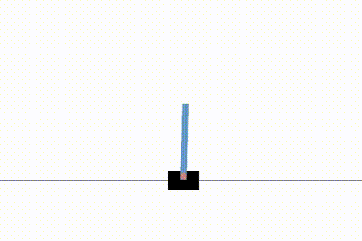
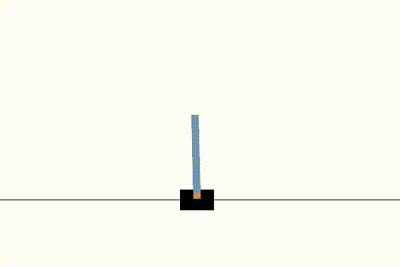

# Blog post

* Intro/Motivation: Why are you doing what you’re doing/why is it cool?
* Data: Where did you get your data? Explanation of the data (features), potentially accompanied by visualisations 
* Method: What kind of algorithm are you using? How does it work? Potentially accompanied by code snippets
* Results: What did you find out? Any cool insights? Definitely accompanied by plots. Convergence plots (epochs vs. acc/loss for train/test data) are a great idea
* Conclusion: What worked, what didn’t? What would you do if you had to improve the project? Potential philosophical musings

---
### Table of conents
1. [Introduction](#introduction)
1. [Data](#data)
1. [Method](#method)
1. [Results](#results)
1. [Conclusion](#conclusion)

---

## Introduction
Our primary interest was to explore how reinforcement learning models are used to create models (such as AlphaGo) that are able to automatically play and win various games on their own. 

We wanted to focus specifically on one type of RLmodel: the Deep Q Network published by Google DeepMind in 2015. This model is one of the most commonly used in reinforcement learning 

Our main focuses of this project are comparing affect these factors on model's performance:
* Policies
* Network architecture:
    * RGB vs gray images
    * Depth of network

## Data
Our RL model is unsupervised, so we add new data, which is generated during the training loop, into dataset use those data as ground truth to train model. To get the data, we use [OpenAI's gym](https://www.gymlibrary.dev/) library to create an Asteroids game. The advantages of this library is that it returns the game screen (state/observation), current score, game status (game is done or not), and other information such as remaining lives. Atari games are typically displayed as 210 x 160 pixel images with a 128-color palatte running at a rate of 60 frames per second. This obviously means that
using the raw Atari data as input would be potentially very computationaly demanding, so the data is preprocessed to make it easier to interpret. Each frame is tranformed into an 84 x 84 pixel image in either grayscale or RGB. 

## Method

### Training
Input: the game screen in color with shape 
Output: action that we should make. There are 14 actions in total according to gym's [documentation](https://www.gymlibrary.dev/environments/atari/asteroids/#actions)

## Results
Compare a trained model vs choosing randomly

Result if we choose randomly (max score of 47 for 10 episodes)

  

Result if we use trained DQN model (trained for 2500 episodes) (max score of 192 for 10 episodes)

## Conclusion
(to be updated)
